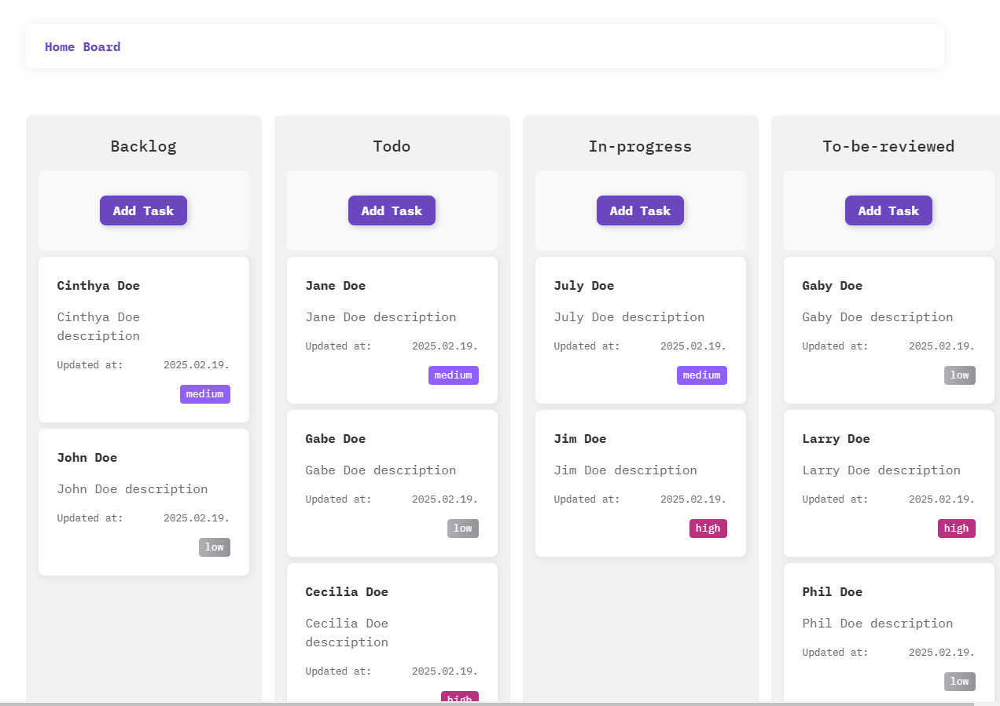

# Kanban Board with Drag and Drop



A Kanban board implementation with smooth drag-and-drop functionality, built with React and TypeScript.
The goal is to practice different drag and drop solutions.

## 🚀 Technologies

- **React 18** - Frontend framework
- **TypeScript** - Type safety and better developer experience
- **Framer Motion** - Smooth animations and drag-and-drop interactions
- **CSS Modules** - Scoped styling solution
- **Vite** - Build tool and development server

## 🎨 Features

- Drag and drop tasks between columns
- Priority-based task styling
- Responsive design
- Custom IBM Plex Mono typography
- Purple-themed modern UI

## 🛠️ Setup

1. Clone the repository
2. Install dependencies:

```bash
npm install
```

3. Run the development server:

```bash
npm run dev
```

